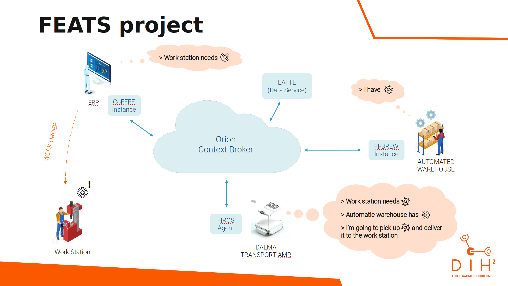

# Architecture

The following image shows the architecture of FEATS:

## FEATS Components Architecture

In order to easily integrate any FEATS component with the ORION Context Broker, an API was created  that works as proxy between all components and ORION. This means that all components of FEATS (CoFFEE, LATTE and FI-BREW) communicate with the broker API (proxy), that converts internal FEATS business models into ORION models, in order to communicate with ORION. These ORION models are the [FIWARE's Smart Data Models](https://www.fiware.org/developers/smart-data-models).

## Code Architecture

All FEATS components are Java Spring Boot applications, and the code is always organized with the following layers:
<ul>
    <li>web</li>
    <li>service</li>
    <li>interface</li>
    <li>base</li>
</ul>

The "web" layer is where the REST endpoints are exposed. The "service" layer contains all the business logic. The "interface" layer contains all the internal and external [DTOs](https://java-design-patterns.com/patterns/data-transfer-object/). And the "base" layer contains all base classes and plugins configurations useful for the remaining layers.

### Broker API

The broker API source code (`broker-api`) is structured into five Java projects:
<ul>
    <li>web</li>
    <li>service</li>
    <li>interface</li>
    <li>fiware</li>
    <li>base</li>
</ul>

The "fiware" layer contains all the logic to communicate with ORION, including all the Smart Data Models used by FEATS, between them the warehouse, material, workstation and work orders, and also the connector to ORION, publishers and subscribers.
The ORION connector is where all the HTTP calls to ORION are performed (regardless of the HTTP method). The publisher and subscriber define all the instructions to write/read to/from ORION.

This API is currently an independent component, but can easily be included in all other components as just one dependency (through [maven dependency](https://maven.apache.org/guides/introduction/introduction-to-dependency-mechanism.html)). It was structured in this way, as an independent component, to have the possibility of independent deployment. In this way it is possible to implement some improvement in the broker API, and all FEATS components automatically have that improvement deploying just this API - avoiding the need of deploy all components, one by one.

### CoFFEE API

The CoFFEE API source code (`coffee-api`) is also structured into five Java projects:
<ul>
    <li>web</li>
    <li>service</li>
    <li>interface</li>
    <li>erp</li>
    <li>base</li>
</ul>

The "erp" layer contains all the logic to integrate with ERPs. To easily support integrate with more ERPs, it was implemented the [Factory design pattern](https://java-design-patterns.com/patterns/factory/). This design pattern consists in "hide the implementation logic and make client code focus on usage rather than initialization".

### FI-BREW API

The FI-BREW API source code (`fibrew-api`) is also structured into five Java projects:
<ul>
    <li>web</li>
    <li>service</li>
    <li>interface</li>
    <li>orm</li>
    <li>base</li>
</ul>

The "orm" layer contains all the logic to integrate with the automatic warehouse. It uses [Object-Relational Mapping](https://en.wikipedia.org/wiki/Object%E2%80%93relational_mapping) to query and manipulate data from a database using object-oriented languages (in this case, Java).